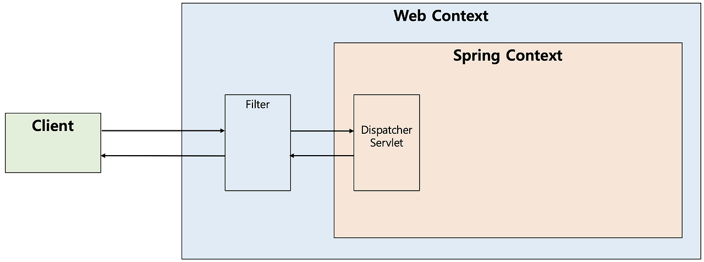
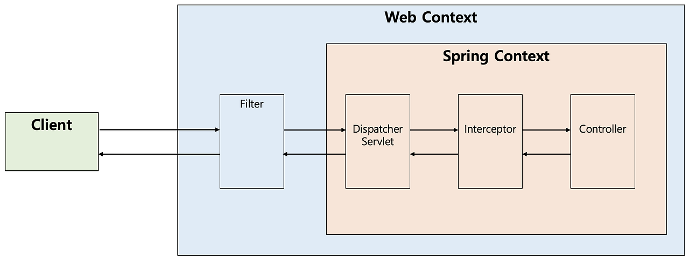

# onboarding_BE

### Requirements

#### 1. Spring Security 기본 이해
- Filter란 무엇인가?(with Interceptor, AOP)  
  - 필터(Filter)는 J2EE 표준 스펙 기능으로 디스패처 서블릿(Dispatcher Servlet)에 요청이 전달되기 전/후에 url 패턴에 맞는 모든 요청에 대해 부가작업을 처리할 수 있는 기능을 제공한다.
   
    
  - 인터셉터(Interceptor)는 J2EE 표준 스펙인 필터(Filter)와 달리 Spring이 제공하는 기술로써, 디스패처 서블릿(Dispatcher Servlet)이 컨트롤러를 호출하기 전과 후에 요청과 응답을 참조하거나 가공할 수 있는 기능을 제공한다.
   

  

  
AOP

  인터셉터 대신에 컨트롤러들에 적용할 부가기능을 어드바이스로 만들어 AOP(Aspect Oriented Programming, 관점 지향 프로그래밍)를 적용할 수도 있지만 다음과 같은 이유들로 컨트롤러의 호출 과정에 적용되는 부가기능들은 인터셉터를 사용하는 편이 낫다.  
  (1) 컨트롤러는 타입과 실행 메소드가 모두 제각각이라 포인트컷(적용할 메소드 선별)의 작성이 어렵다. 
  (2) 컨트롤러는 파라미터나 리턴 값이 일정하지 않다. 
  (3) AOP에서는 HttpServletRequest/Response를 객체를 얻기 어렵지만 인터셉터에서는 파라미터로 넘어온다.  

- Spring Security란?
  -  
#### 2. JWT 기본 이해
- JWT란 무엇인가?
  - JWT는 유저를 인증하고 식별하기 위한 토큰(Token) 기반 인증이다. 
  - 토큰 자체에 사용자의 권한 정보나 서비스를 사용하기 위한 정보가 포함된다.
  - RESTful과 같은 무상태(Stateless)인 환경에서 사용자 데이터를 주고받을 수 있다.
  
#### 3. Access / Refresh Token 발행과 검증
- 토큰 발행 : JwtUtil createToken()
  - 토큰 발행 테스트 : JwtUtilTest testCreateToken()
- 유효성 확인 : JwtUtil validateToken()
  - 유효성 확인 테스트 : JwtUtilTest 경우별 testValidateToken()

#### 4. 백엔드 EC2 배포 / Swagger UI
- 회원가입 /api/signup (UserController에 구현)
- 로그인 /api/login (JwtAuthenticationFilter에 구현)
  
  http://54.180.143.109:8080  
  http://54.180.143.109:8080/swagger-ui/index.html